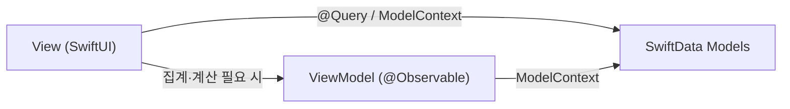

# moov 아키텍처

기술 스택, 프로젝트 구조, 아키텍처 패턴을 정의한다. 엔티티 정의는 [data-model.md](./data-model.md), 기능 요구사항은 [functional-spec.md](./functional-spec.md) 참고.

## 기술 스택

현재 `moov.xcodeproj` 설정 기준.

| 항목 | 값 |
|---|---|
| 언어 | Swift (SWIFT_VERSION 5.0) |
| UI 프레임워크 | SwiftUI |
| 영속성 | SwiftData |
| 배포 타겟 | iOS 26.5+ |
| 지원 기기 | iPhone, iPad (TARGETED_DEVICE_FAMILY: 1,2) |
| 번들 ID | kr.me.seesaw.moov |
| 빌드 시스템 | Xcode 프로젝트 (SwiftPM 패키지 아님) |
| 타겟 | moov(앱), moovTests(유닛 테스트), moovUITests(UI 테스트) |

## 폴더 구조

현재는 Xcode 기본 템플릿 그대로다(`ContentView.swift`, `Item.swift`가 더미 상태). 기능 구현 시 아래와 같이 구성한다.

```
moov/
├── moovApp.swift            # 앱 진입점, ModelContainer 구성
├── Models/                  # SwiftData @Model 엔티티 (data-model.md와 1:1 대응)
│   ├── WorkoutSession.swift
│   ├── WorkoutPart.swift
│   ├── ExerciseBlock.swift
│   ├── WorkoutResult.swift
│   ├── Exercise.swift
│   ├── Tag.swift
│   ├── PersonalRecord.swift
│   ├── ConditionNote.swift
│   └── WorkoutTemplate.swift   # TemplatePart, TemplateBlock 포함
├── Views/
│   ├── Session/              # UC-01(기록), UC-02(조회), UC-05(컨디션 메모)
│   ├── History/               # UC-03(종목별/태그별 추이)
│   ├── PersonalRecord/        # UC-04
│   ├── Template/               # UC-06
│   ├── Catalog/                 # UC-07(종목 관리), UC-08(태그 관리)
│   └── Components/            # 재사용 UI 컴포넌트 (블록 입력행, 태그 칩 등)
├── ViewModels/               # 집계·계산 로직이 필요한 화면에 한해 추가 (아래 아키텍처 패턴 참고)
├── Extensions/
└── Assets.xcassets
moovTests/
moovUITests/
```

## 아키텍처 패턴

**MV(Model-View) 기반, 필요한 화면에 한해서만 경량 ViewModel을 둔다.** SwiftData의 `@Model`/`@Query`가 이미 관찰 가능한 데이터 계층을 제공하므로, 별도 Repository나 전면적인 MVVM으로 감싸지 않는다.

- **단순 CRUD 화면** (FR-01 세션 CRUD, FR-03 블록 입력, FR-05 목록/상세, FR-09 템플릿 CRUD, FR-11 종목 관리, FR-12 태그 관리): View가 `@Query`와 `@Environment(\.modelContext)`로 SwiftData를 직접 다룬다. 중간 계층 없이 View ↔ Model.
- **집계·계산이 필요한 화면**: 별도 `@Observable` 타입으로 로직을 분리해 View에서 재사용하고 유닛 테스트 대상으로 삼는다.
  - FR-06/UC-03 종목별 히스토리, FR-13/UC-03 태그별 집계 추이 → 기간별 집계 계산
  - FR-07/UC-04 PR 갱신 판단(기존 값과 비교) 로직



## 결정 사항

- **iCloud 동기화: 로컬 전용 유지**. `moovApp.swift`는 로컬 전용 `ModelConfiguration`을 사용한다. CloudKit 연동을 실제로 시도해본 결과, 다음 조건이 모두 필요하다는 것을 확인했다:
  - 모든 비옵셔널 스칼라 프로퍼티에 기본값 필요 (`var id: UUID = UUID()` 등)
  - **모든 to-many 관계 배열이 옵셔널 타입이어야 함** (`[WorkoutPart]`가 아니라 `[WorkoutPart]?`) — 이 요구사항은 `session.parts.append(...)`처럼 배열에 직접 접근하는 앱 전역의 모든 View 코드 수정을 요구해 파급 범위가 매우 크다
  - `ExerciseBlock.tags`/`TemplateBlock.tags`처럼 인버스가 없는 다대다 관계는 `Tag` 쪽에 명시적 인버스 컬렉션 추가 필요
  - 실제 동기화 활성화는 사용자의 Apple Developer 팀 계정으로 Xcode에서 iCloud + CloudKit capability를 직접 추가해야 함(에이전트가 대신 할 수 없음)

  파급 범위(전체 모델 + 거의 모든 View 파일) 대비 지금 시점에 얻는 이득이 크지 않다고 판단해 로컬 전용을 유지하기로 했다. 이후 다시 검토할 경우 위 네 가지가 실제 변경 범위다.
