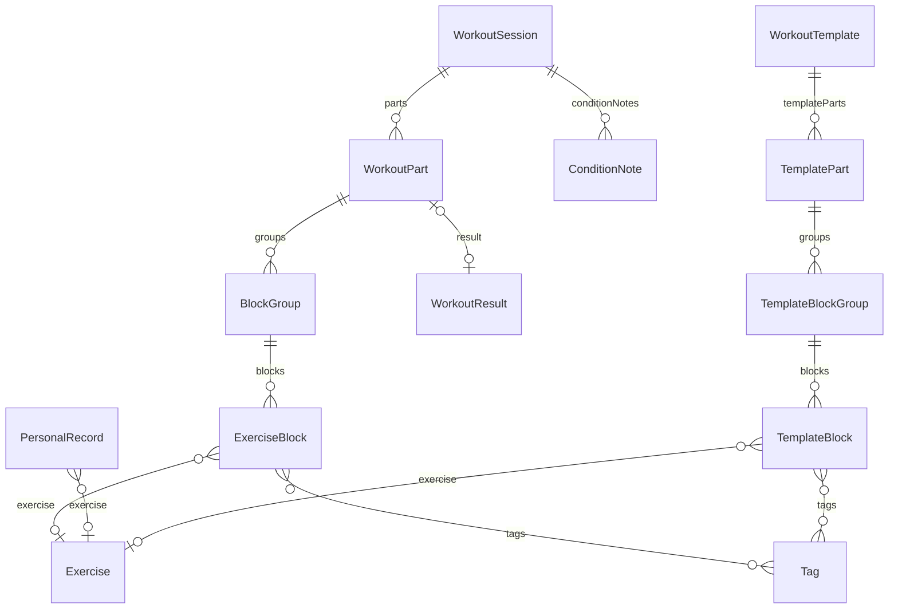

# moov 데이터 모델

[functional-spec.md](./functional-spec.md)에서 언급된 엔티티를 필드/타입/관계 수준으로 정의한다. SwiftData `@Model` 선언을 염두에 둔 구조다.

## 설계 원칙

1. **세션은 여러 개의 수행 단위(Part)로 구성된다.** 웜업 하나, 본운동 하나, 보조운동 하나라는 고정 개수/순서를 가정하지 않는다. 실제 일지에서도 "Session A(Strength) → Session B(For Time) → Accessory(EMOM)"처럼 포맷과 결과가 다른 본운동이 한 세션에 여러 번 등장한다. 이를 위해 포맷과 결과는 세션이 아니라 **`WorkoutPart` 단위**로 귀속시킨다.
2. **웜업/본운동/보조운동 여부는 고정 슬롯이 아니라 태그다.** 하나의 블록이 여러 태그를 가질 수 있고(예: "본운동" + "컨디셔닝"), 태그 종류와 개수에 제약이 없다.
3. **종목명과 태그는 자유 텍스트가 아니라 카탈로그(`Exercise`, `Tag`) 참조다.** 표기 차이(대소문자, 띄어쓰기 등)로 인한 히스토리 조회 누락을 막고, 사용자가 프리셋에 없는 항목을 직접 추가할 수 있게 한다.
4. **종목 삭제는 참조만 끊고, 이름은 스냅샷으로 보존한다.** `Exercise`를 삭제해도 `exercise` 참조만 nil이 되고(`ExerciseBlock`/`PersonalRecord`/`TemplateBlock`에 저장된 `exerciseName` 스냅샷 덕분에) 과거 기록의 종목명은 그대로 유지된다. 태그는 이 정책을 적용하지 않는다 — 태그 삭제 시 이름 보존 없이 블록에서 태그만 제거된다(FR-12).
5. **스트레이트 세트와 서킷은 별도의 방식 플래그가 아니라 그룹 크기로 구분한다.** `WorkoutPart`는 블록을 직접 갖지 않고 `BlockGroup`을 통해 갖는다. 그룹에 블록이 1개면 스트레이트 세트(`rounds`가 세트수 역할), 2개 이상이면 서킷(`rounds`만큼 여러 종목을 번갈아 반복)이다(FR-20).

## ER 다이어그램



## 엔티티

### WorkoutSession

세션(하루의 운동 기록) 단위. FR-01, FR-05.

| 필드 | 타입 | 설명 |
|---|---|---|
| id | UUID | 식별자 |
| date | Date | 세션 날짜 |
| parts | [WorkoutPart] | 순서가 있는 수행 단위 목록. 개수/순서 제약 없음 |
| conditionNotes | [ConditionNote] | 컨디션/부상 메모 (0개 이상) |
| notes | String? | 세션 전체에 대한 자유 텍스트 노트 |

### WorkoutPart

세션 내 하나의 수행 단위. 포맷과 결과는 세션이 아니라 여기 귀속된다. FR-02, FR-04.

| 필드 | 타입 | 설명 |
|---|---|---|
| id | UUID | 식별자 |
| order | Int | 세션 내 수행 순서 |
| format | WorkoutFormat | EMOM/AMRAP/For Time/Interval/Rounds/Strength |
| timeCapSeconds | Int? | 타임캡(선택) |
| groups | [BlockGroup] | 순서가 있는 블록 그룹 목록 |
| result | WorkoutResult? | 결과 (웜업처럼 결과가 없는 Part는 nil) |

> 웜업처럼 결과를 남기지 않는 Part도 있을 수 있으므로 `result`는 옵셔널이다.

### BlockGroup

파트 안에서 함께 반복되는 블록 묶음. 블록이 1개면 스트레이트 세트, 2개 이상이면
서킷(라운드마다 여러 종목을 번갈아 수행)을 뜻한다 — 별도의 방식 플래그 없이 그룹의
블록 수 자체가 구분을 표현한다. FR-20.

| 필드 | 타입 | 설명 |
|---|---|---|
| id | UUID | 식별자 |
| order | Int | Part 내 순서 |
| rounds | Int | 이 그룹을 몇 라운드 반복하는지 (기본값 1) |
| blocks | [ExerciseBlock] | 순서가 있는 블록 목록 (1개 이상) |

### ExerciseBlock

종목 단위 블록. 몇 라운드 반복하는지는 블록이 아니라 소속된 `BlockGroup`이 정한다. FR-03, FR-10, FR-20.

| 필드 | 타입 | 설명 |
|---|---|---|
| id | UUID | 식별자 |
| order | Int | 그룹 내 순서 |
| exercise | Exercise? | 종목 카탈로그 참조 (삭제 시 nil) |
| exerciseName | String | 기록 시점 종목명 스냅샷 (exercise가 삭제/개명돼도 유지) |
| weight | Double? | 무게 |
| weightUnit | WeightUnit? | lb/kg |
| reps | Int? | 반복수 |
| restSeconds | Int? | 휴식시간 |
| tags | [Tag] | 다중 태그 (웜업/본운동/보조운동/컨디셔닝 등, 프리셋+사용자 정의) |

### WorkoutResult

Part의 수행 결과. 포맷에 따라 사용하는 필드가 다르다. FR-04.

| 필드 | 타입 | 설명 |
|---|---|---|
| id | UUID | 식별자 |
| kind | ResultKind | `.time` / `.roundsAndReps` / `.passFail` / `.maxWeight` |
| timeSeconds | Int? | For Time/Interval 완료 시간 |
| rounds | Int? | AMRAP/Rounds 완료 라운드 수 |
| extraReps | Int? | 마지막 미완료 라운드의 추가 렙 |
| isCompleted | Bool? | EMOM 등 성공/실패 여부 |
| maxWeight | Double? | Strength 포맷의 최대 중량 |
| completionNote | String? | "3라운드부터 15개→5개로 조정" 같은 서술형 보충 설명 |

### Exercise

사용자 정의 가능한 운동 종목 카탈로그. FR-11.

| 필드 | 타입 | 설명 |
|---|---|---|
| id | UUID | 식별자 |
| name | String | 종목명 (고유) |
| category | String? | 카테고리(선택, 예: 웨이트리프팅/체조/컨디셔닝) |
| defaultWeightUnit | WeightUnit? | 기본 무게 단위(선택) |

> 종목을 삭제하면 `exercise` 참조만 nil로 끊어지고, `ExerciseBlock`/`PersonalRecord`/`TemplateBlock`에 저장된 `exerciseName` 스냅샷으로 과거 기록의 종목명이 그대로 유지된다. 삭제 UI에서는 "이미 N개 기록에 사용 중입니다" 같은 확인 안내를 표시한다(FR-11).

### Tag

사용자 정의 가능한 태그 카탈로그. FR-10, FR-12.

| 필드 | 타입 | 설명 |
|---|---|---|
| id | UUID | 식별자 |
| name | String | 태그명 (고유) |
| colorHex | String? | UI 표시용 색상(선택) |

> 앱 최초 실행 시 웜업/본운동/보조운동 등 프리셋 태그를 기본 데이터로 시딩한다.

### PersonalRecord

종목별 1RM 기록. append-only 로그로 관리하며, 별도의 "이전 값" 필드 없이 이력 전체가 곧 로그다. FR-07.

| 필드 | 타입 | 설명 |
|---|---|---|
| id | UUID | 식별자 |
| exercise | Exercise? | 종목 카탈로그 참조 (삭제 시 nil) |
| exerciseName | String | 기록 시점 종목명 스냅샷 |
| weight | Double | 기록 중량 |
| weightUnit | WeightUnit | lb/kg |
| date | Date | 기록 날짜 |

> 특정 종목의 "현재 PR"은 해당 종목 로그 중 최댓값으로 조회 시점에 계산한다.

### ConditionNote

컨디션/부상 메모. 세션당 여러 개(부위별)를 허용한다. FR-08.

| 필드 | 타입 | 설명 |
|---|---|---|
| id | UUID | 식별자 |
| bodyPart | String? | 통증 부위(선택) |
| painLevel | Int? | 통증 강도 1~10(선택) |
| memo | String | 자유 텍스트 메모 |

### WorkoutTemplate / TemplatePart / TemplateBlock

재사용 가능한 운동 구성 템플릿. `WorkoutPart`/`ExerciseBlock`과 동일한 형태를 따르되, 수행 결과(`WorkoutResult`)가 없는 "설계도" 버전이다. FR-09.

| 엔티티 | 필드 | 타입 | 설명 |
|---|---|---|---|
| WorkoutTemplate | id | UUID | 식별자 |
| WorkoutTemplate | name | String | 템플릿 이름 |
| WorkoutTemplate | templateParts | [TemplatePart] | 순서가 있는 Part 구성 |
| TemplatePart | order | Int | 순서 |
| TemplatePart | format | WorkoutFormat | 기본 포맷 |
| TemplatePart | groups | [TemplateBlockGroup] | 순서가 있는 블록 그룹 구성 |
| TemplateBlockGroup | order/rounds | - | `BlockGroup`과 동일 필드 |
| TemplateBlockGroup | blocks | [TemplateBlock] | 순서가 있는 블록 목록 |
| TemplateBlock | exercise | Exercise? | 종목 카탈로그 참조 (삭제 시 nil) |
| TemplateBlock | exerciseName | String | 기록 시점 종목명 스냅샷 |
| TemplateBlock | weight/weightUnit/reps/restSeconds | - | `ExerciseBlock`과 동일 필드 |
| TemplateBlock | tags | [Tag] | 다중 태그 |

> 템플릿을 세션에 적용하면 `TemplatePart` → `WorkoutPart`(결과는 비워둔 채), `TemplateBlock` → `ExerciseBlock`으로 복사된다. 템플릿 삭제는 이미 복사되어 생성된 세션 데이터에 영향을 주지 않는다.

## 열거형

```swift
enum WorkoutFormat {
    case emom, amrap, forTime, interval, rounds, strength
}

enum WeightUnit {
    case lb, kg
}

enum ResultKind {
    case time            // For Time / Interval
    case roundsAndReps   // AMRAP / Rounds
    case passFail        // EMOM 등
    case maxWeight        // Strength
}
```

## FR/UC ↔ 엔티티 매핑

| FR/UC | 관련 엔티티 |
|---|---|
| FR-01, UC-01, UC-02 | WorkoutSession |
| FR-02 | WorkoutPart.format |
| FR-03, FR-10 | ExerciseBlock, Tag |
| FR-04 | WorkoutResult |
| FR-05 | WorkoutSession, WorkoutPart |
| FR-06, UC-03 | ExerciseBlock, Exercise |
| FR-07, UC-04 | PersonalRecord |
| FR-08, UC-05 | ConditionNote |
| FR-09, UC-06 | WorkoutTemplate, TemplatePart, TemplateBlock |
| FR-11, UC-07 | Exercise |
| FR-12, UC-08 | Tag |
| FR-13 | ExerciseBlock.tags, Tag |
| FR-20 | BlockGroup, TemplateBlockGroup |
