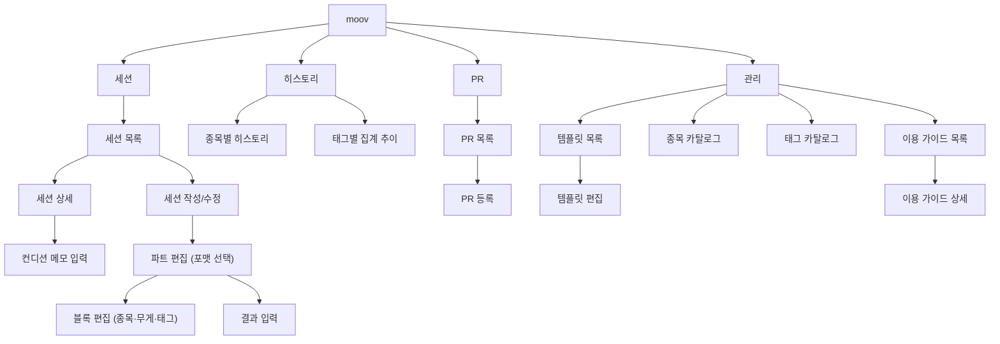

# moov 정보 구조도

앱의 화면 계층 구조를 정의한다. 화면 간 이동 흐름(사용자가 특정 작업을 어떻게 수행하는지)은 [screen-flow.md](./screen-flow.md) 참고.

## 최상위 구조

4개 탭(TabView) 기준으로 구성한다.

## 화면 ↔ UC/FR 매핑

| 화면 | 관련 UC/FR |
|---|---|
| 세션 목록 | UC-02, FR-05 |
| 세션 작성/수정 | UC-01, FR-01 |
| 파트 편집 (포맷 선택) | UC-01, FR-02 |
| 블록 편집 (종목·무게·태그) | UC-01, FR-03, FR-10 |
| 결과 입력 | UC-01, FR-04 |
| 세션 상세 | UC-02, FR-05 |
| 컨디션 메모 입력 | UC-05, FR-08 |
| 종목별 히스토리 | UC-03, FR-06 |
| 태그별 집계 추이 | UC-03, FR-13 |
| PR 목록 / PR 등록 | UC-04, FR-07 |
| 템플릿 목록 / 템플릿 편집 | UC-06, FR-09 |
| 종목 카탈로그 | UC-07, FR-11 |
| 태그 카탈로그 | UC-08, FR-12 |
| 이용 가이드 목록 / 이용 가이드 상세 | UC-12, FR-23 |

## 참고

- "블록 편집" 화면에서는 종목 카탈로그·태그 카탈로그를 즉시 검색/추가할 수 있어(FR-11, FR-12) "관리" 탭의 카탈로그 화면과 데이터를 공유한다. 정보 구조상으로는 별도 화면이지만 진입 경로가 두 곳(관리 탭 직접 진입, 블록 편집 중 즉시 추가)이라는 점을 architecture.md의 Views/Catalog 구현 시 고려한다.
- 탭 구성(4개)과 이름은 초안이며, UI 구현 중 조정될 수 있다.
