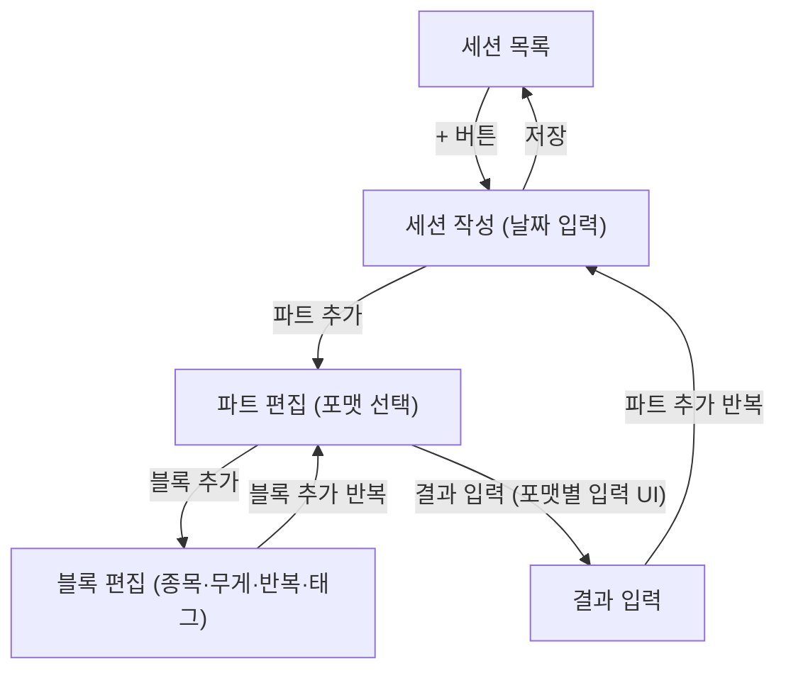
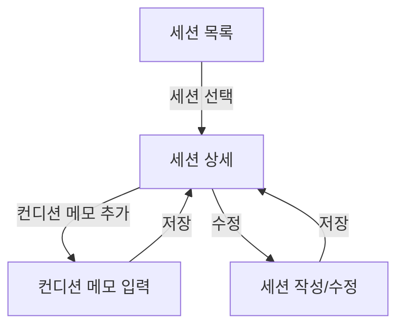
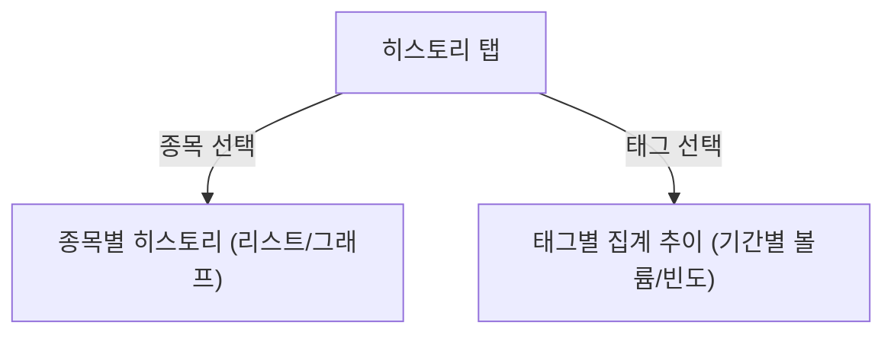
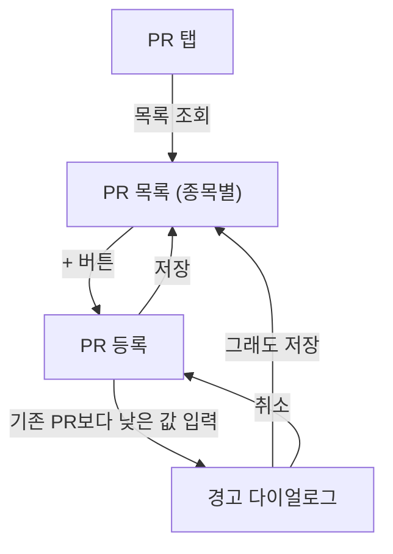
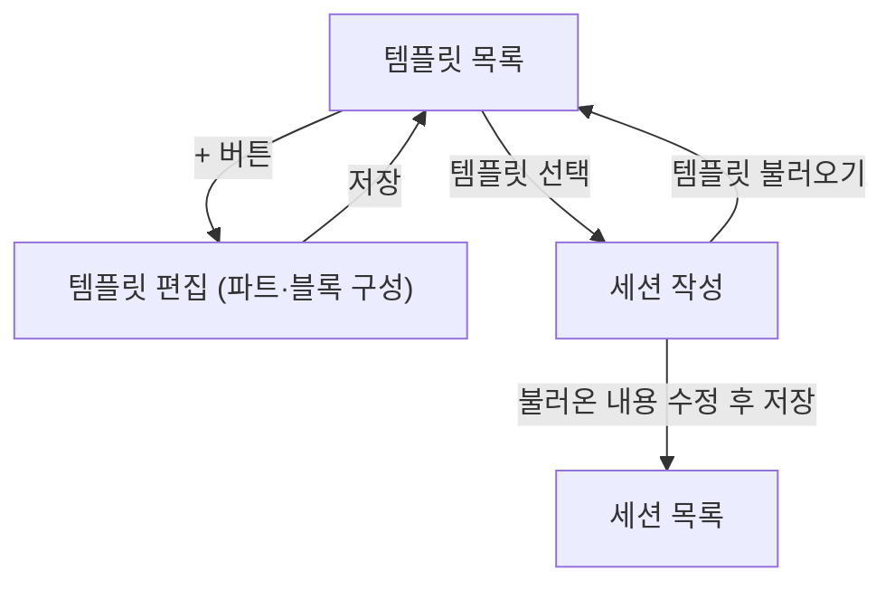
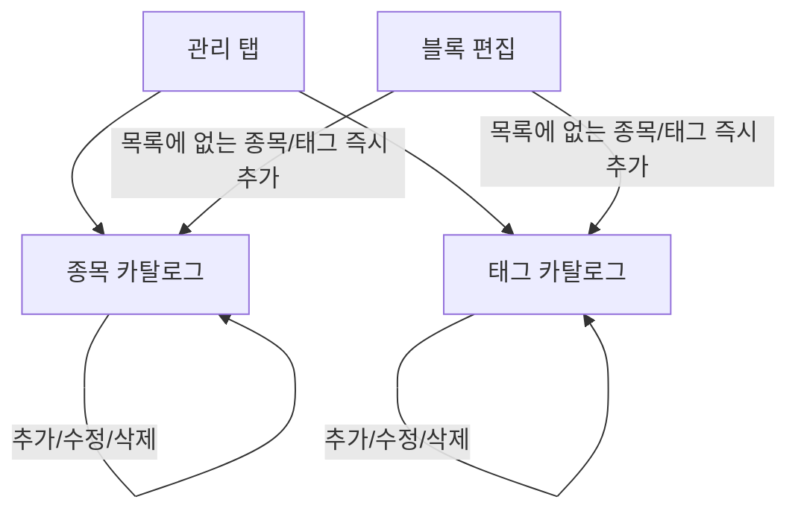

# moov 화면 흐름

주요 유즈케이스별로 사용자가 화면을 어떻게 이동하며 작업을 완료하는지 정의한다. 화면 계층 구조는 [information-architecture.md](./information-architecture.md) 참고.

## UC-01. 운동 세션 기록

- 파트/블록은 개수 제약이 없으므로 "파트 추가"와 "블록 추가"는 각각 반복 가능하다(FR-02, FR-03).
- 웜업처럼 결과가 없는 파트는 결과 입력을 건너뛸 수 있다(FR-04).

## UC-02 / UC-05. 세션 조회 및 컨디션 메모

## UC-03. 종목별/태그별 기록 추이 조회

## UC-04. PR(1RM) 관리

## UC-06. 운동 프로그램 템플릿 관리 및 적용

## UC-07 / UC-08. 종목·태그 카탈로그 관리

- 종목 삭제 시 "이미 N개 기록에 사용 중입니다" 확인 다이얼로그를 표시한다(FR-11). 태그 삭제는 별도 확인 없이 즉시 반영된다(FR-12).
